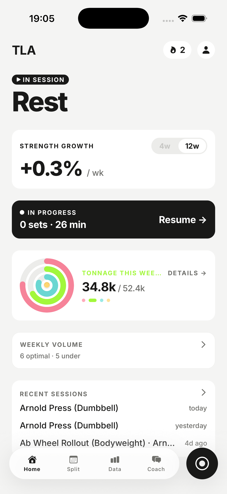
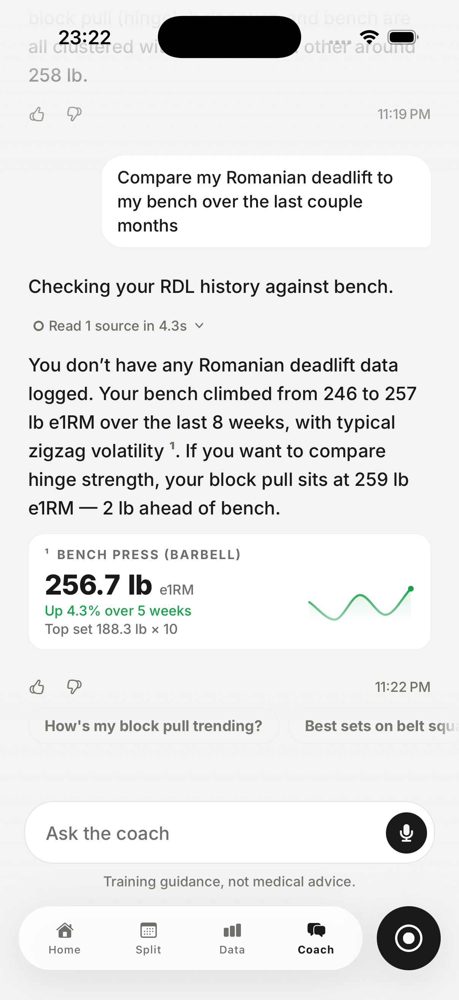
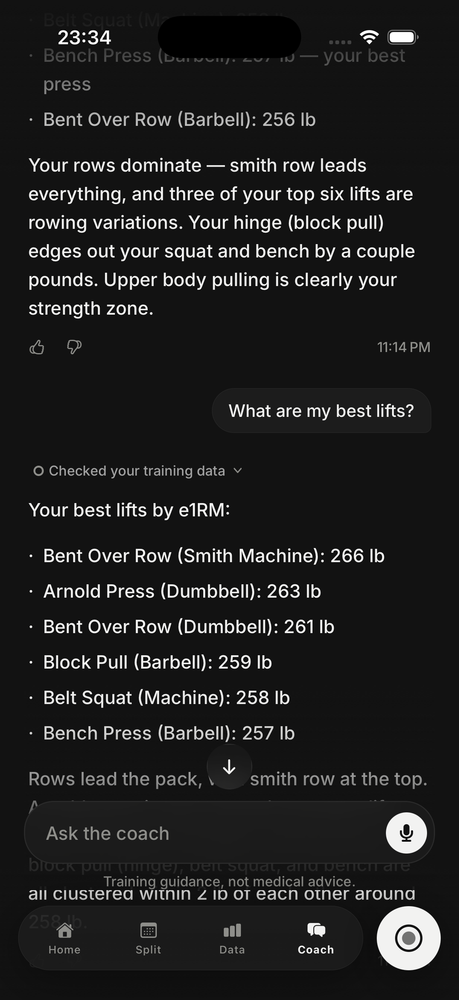
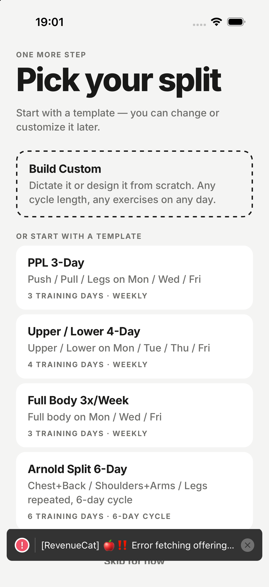

# The Lifting App

**Strength training, quantified.** A workout log for iOS with an AI coach
that reads your numbers before it says anything.

[theliftingapp.com](https://www.theliftingapp.com) · Coming to the App Store ·
Built solo, April to October 2026

  
  
  
  

## What it does

Log a set in two taps. Every lift gets an estimated one-rep max, every new
best is flagged the moment it's logged, and your big lifts sit against
published strength standards for your bodyweight. A Strength Growth Rate
card fits a regression over your last 4 or 12 weeks and reports one
number: percent per week.

The coach is the point. It's a persistent chat with Claude that, before
answering, reads your profile, your split, your recent sets, and your
all-time bests, then runs lookups against your history and **shows you
what it read**:

- a trace of every lookup, with a count of what came back, that folds to
  "Read 2 sources in 1.2s" once the answer starts
- numbered citations in the reply, rendered as superscripts, with the
  data behind each one (a weekly e1RM trend with a sparkline, a list of
  sets, an all-time best) placed under the sentence that cited it
- proposals, not actions: it can draft a new split or edit one day of
  yours, and you apply or dismiss the card

It answers in two speeds. With a workout open it limits itself to one
lookup and two sentences so it fits between sets. At a desk it takes up
to four passes.

You can dictate a message, or dictate an entire training split and
watch it become a program.

The rest of the app is what a serious log needs: sets that queue offline
and sync when signal returns, a Live Activity on the lock screen, a home
screen widget, Apple Health in both directions, supersets, partials,
duration and distance work, kg and lb per set, and a recap after every
session with a tee-up for the next one.

## Stack

| Layer | Choice |
|---|---|
| App | Expo SDK 54, React Native 0.81 (New Architecture), Expo Router, TypeScript strict, NativeWind, Reanimated 4 |
| Backend | Supabase: Postgres with Row Level Security on every table, Auth, Storage, Deno edge functions |
| AI | Claude Sonnet 4.5 with tool use, streamed to the device as newline-delimited events |
| Native | A local Expo module (App Group writes, ActivityKit) and a SwiftUI widget extension with a Live Activity |
| Billing | RevenueCat, with a replay-safe webhook mirroring entitlements into the database |
| Quality | Vitest on the pure domain layer (51 test files, 712 tests), ESLint, strict TypeScript, Sentry, Maestro flows on the simulator |

About 56,000 lines of TypeScript on the device, 7,000 in edge functions,
1,000 of Swift, 75 migrations, 490 commits.

## Architecture

Four layers with one rule each.

- **`src/domain`** is pure: no React, no native modules, no I/O. The
  one-rep-max model, the growth-rate regression, PR classification, the
  next-set engine, the coach's event reducer, and the parsers all live
  here and are tested as plain functions.
- **`src/data`** is the only layer that imports the Supabase client.
  Repositories, the offline set queue, the streaming client for the
  coach, Health and widget sync.
- **`src/ui`** is presentation, built on a design system ("Chalk") that
  owns no hue: the accent is the ink, and only semantic colours carry
  chroma. Every tap answers the finger; there are no spinners.
- **`src/app`** is routing and screens, kept thin.

Some decisions worth defending:

- **Authorization lives in the database.** RLS on all 27 tables, enforced
  by an event trigger that enables it on new ones. Every edge function
  derives identity from the JWT and never trusts an id from the body.
  Pro entitlement is checked server-side; the client check fails open on
  purpose so an over-the-air update can never lock out a binary that
  lacks the purchases module.
- **Numbers are computed once.** One e1RM model shared by the device and
  all three edge functions, so the coach never contradicts the screen.
  One PR classifier feeds the set badge, the session strip, and the
  recap, with an epsilon guard against the database's rounding. Nothing
  optimistic renders unless it will be right on the first frame.
- **The coach's reasoning is a contract.** The function streams typed
  events (lede, step, source, delta, followups, done) and persists the
  same facts on the message, so history renders the exact trace the
  live reply showed. A caller without the stream flag still gets one
  JSON body.
- **Native surfaces fail open.** New fields in the widget payload are
  optional on the Swift side so an old widget can read a new payload.
  Anything the binary might lack (HealthKit, blur, purchases) is probed
  at runtime before it's rendered.
- **Logging survives the gym.** Inserts carry client-chosen ids so a
  retry can't duplicate a set. A set logged without signal is kept on
  the phone and synced later; ending a session with unsynced sets is
  refused rather than losing them.

## Status

In TestFlight with a small group of lifters. App Store submission is in
progress. The code is private while it's a one-person product; this
repo is its public face. If you want to see something specific, ask:
rsbryan on GitHub.
